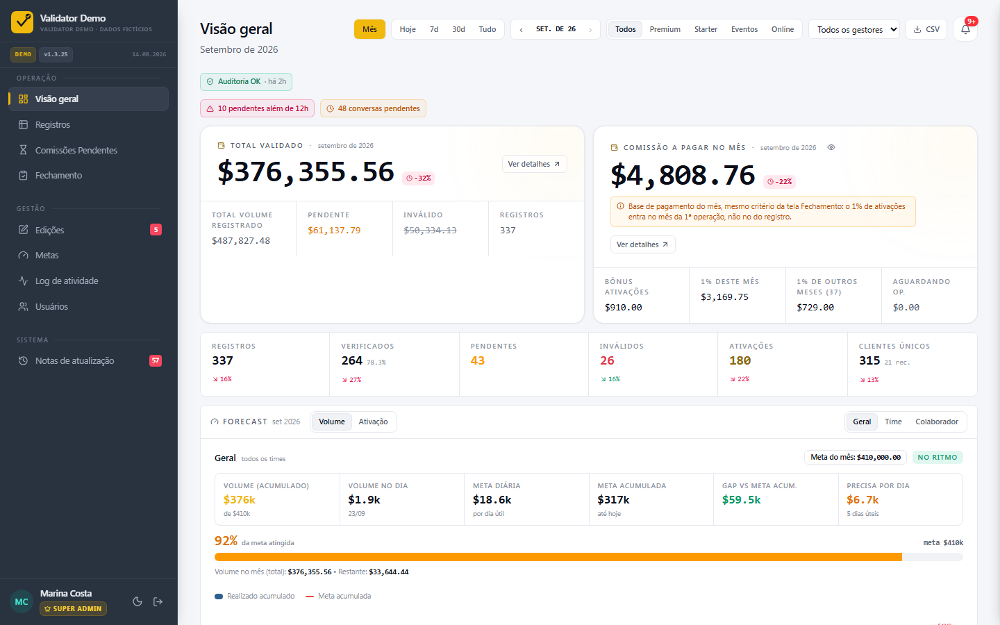
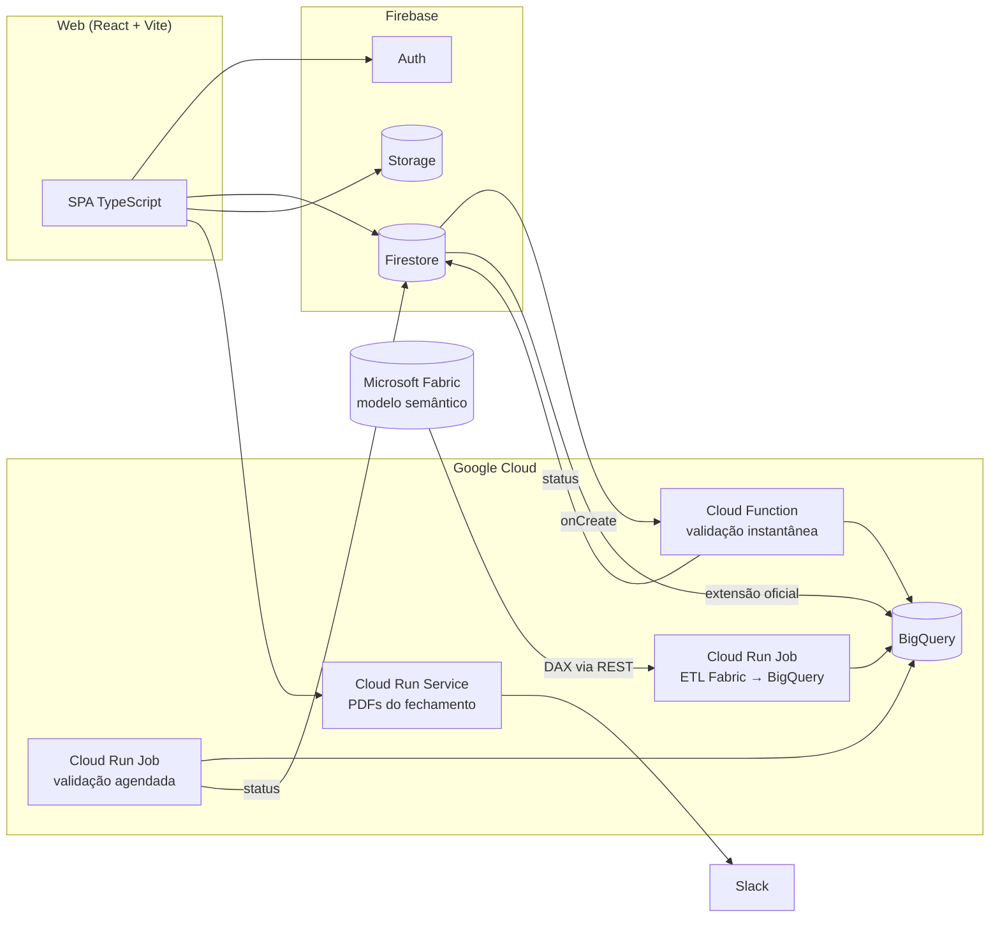
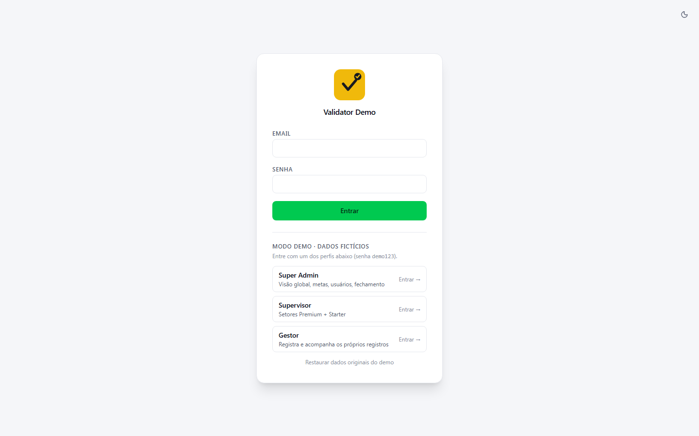
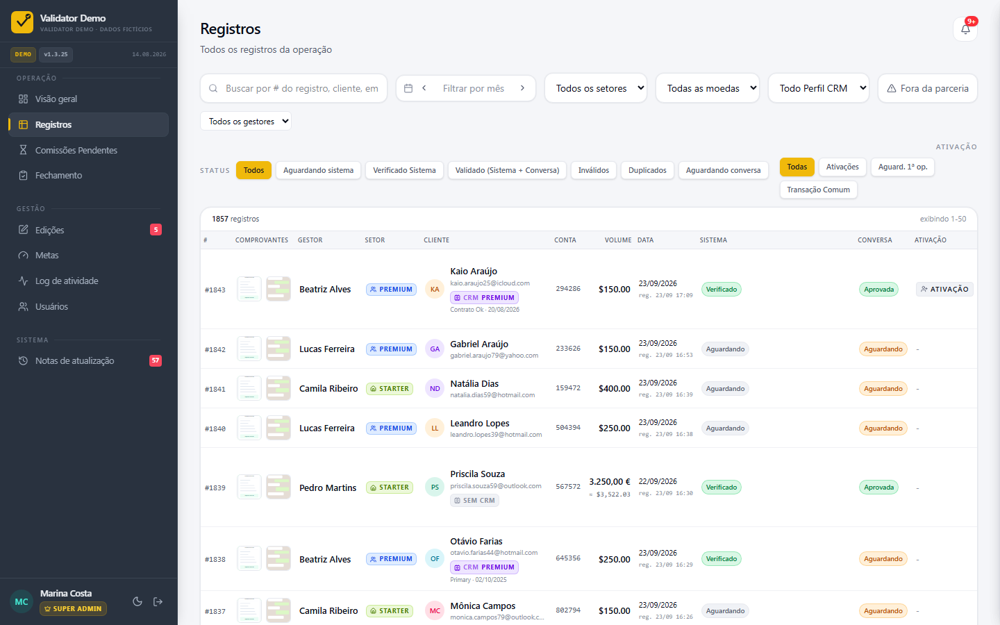
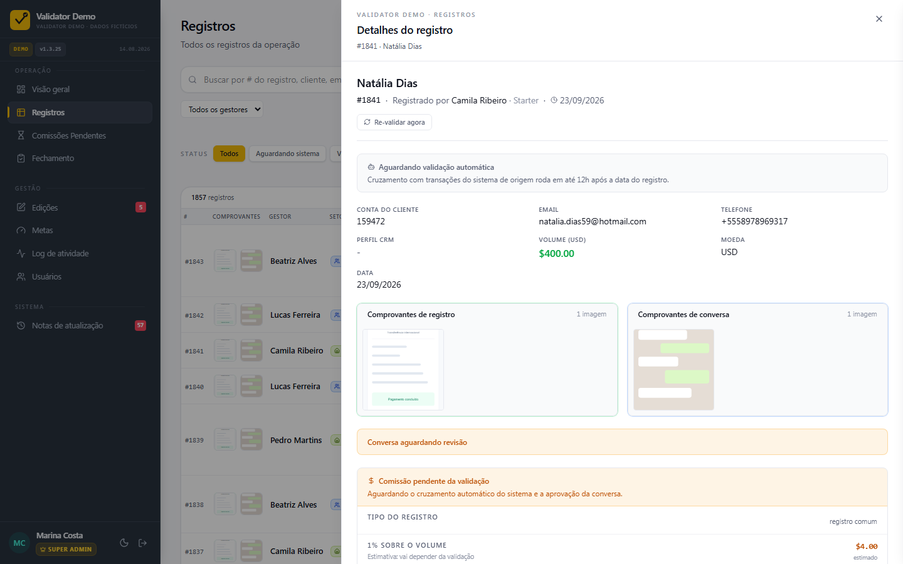
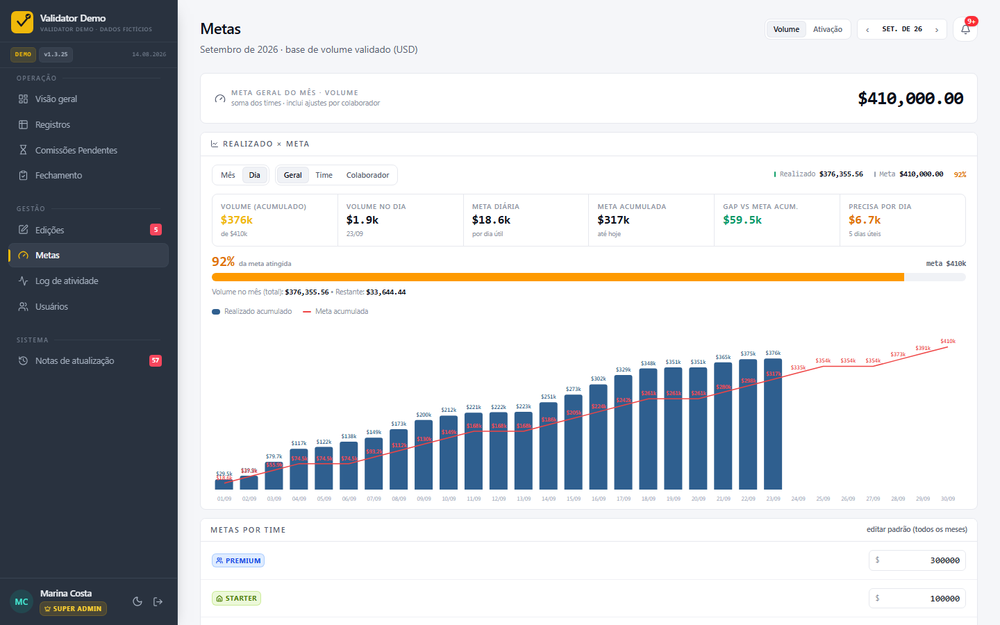
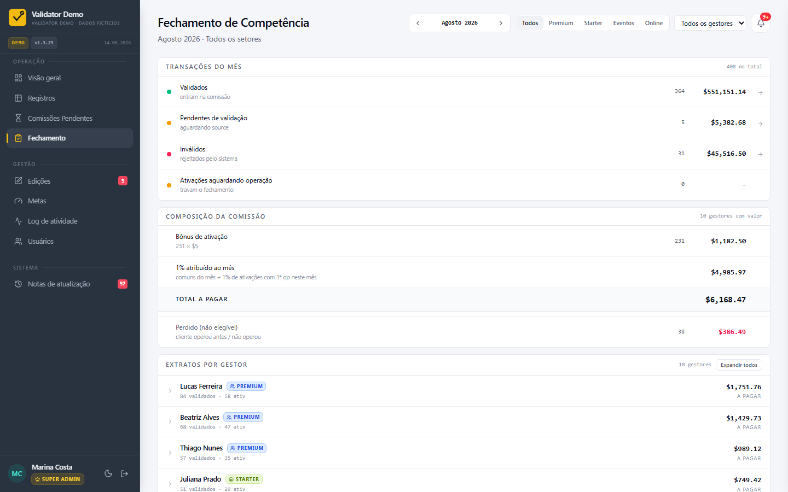
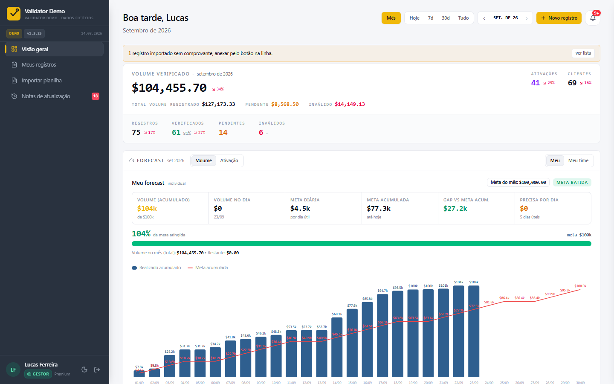
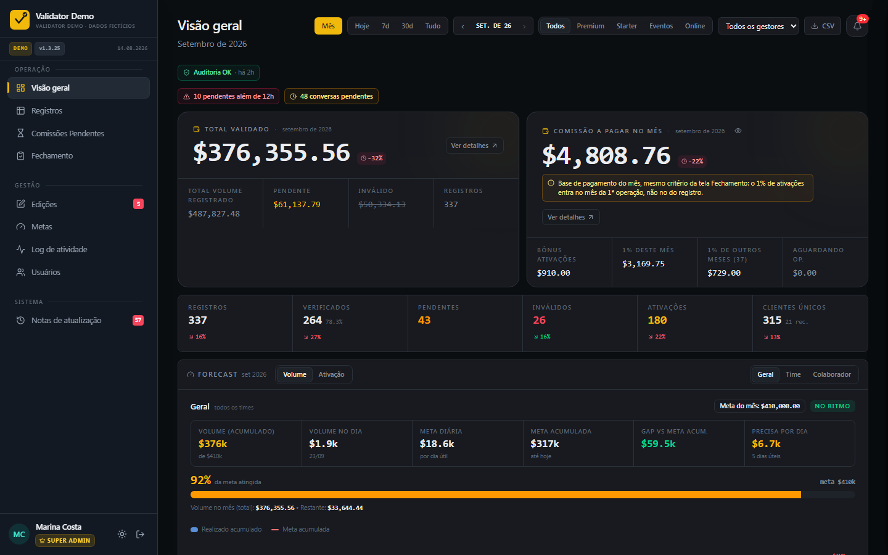
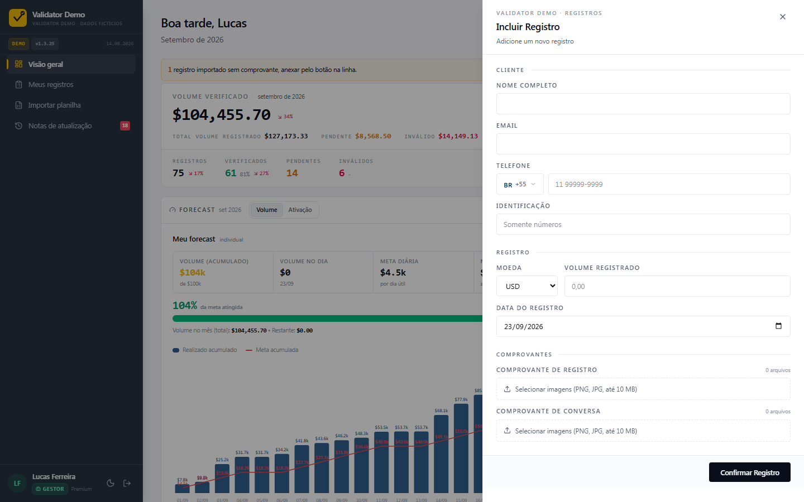

# Validator Demo

**Sistema de registro, validação automática e comissionamento de transações para equipes comerciais.**

🔗 **Demo ao vivo:** https://lucasaugb.github.io/validator-demo/ (entre com um dos perfis na tela de login: Super Admin, Supervisor ou Gestor)

> Versão de portfólio de um sistema que desenvolvi e mantenho em produção. Nomes, empresa, setores, clientes e valores foram **substituídos por dados fictícios**. A demo roda 100% no navegador com um backend simulado, então nada do que você fizer sai da sua máquina.



---

## O problema

A equipe comercial registrava transações de clientes em planilhas, e a conferência era manual: alguém cruzava valores, datas e contas com os relatórios do sistema de origem antes de calcular a comissão de cada vendedor. Isso gerava:

- **fraude e duplicidade**: dois vendedores registrando a mesma transação;
- **comissão paga errada**, porque "ativação" (primeira transação do cliente) e "cliente já operou" eram checados à mão;
- **fechamento mensal lento**, com dias de conferência e PDFs montados manualmente.

## A solução

Uma aplicação web em que o vendedor registra a transação com comprovantes, e um **pipeline de dados valida cada registro automaticamente** contra a base oficial de transações. A comissão só é calculada sobre o que foi validado.

| Etapa | O que acontece |
| --- | --- |
| **Registro** | O gestor informa cliente, conta, valor, moeda e data, e anexa os comprovantes (as imagens são comprimidas no cliente). |
| **Validação automática** | Um job cruza o registro com as transações do sistema de origem (conta → valor → moeda → data, janela de 12h). O resultado é **verificado**, **inválido** (com o "melhor candidato" encontrado e quais campos divergem) ou **duplicado** (alerta de fraude entre gestores). |
| **Validação da conversa** | O supervisor aprova ou rejeita o print da conversa com o cliente. As duas validações são independentes. |
| **Ativação** | A primeira transação do cliente (por pessoa, não por conta) gera bônus fixo. O 1% sobre o volume de uma ativação só é devido quando o cliente opera, e cai no mês da 1ª operação. |
| **Câmbio** | EUR e GBP são convertidos para USD pela cotação do dia da transação. Toda métrica e comissão é em USD. |
| **Fechamento** | Tela mês × setor com o extrato por gestor e um bloqueio quando há pendências. Em produção, um serviço gera PDFs e envia a cada gestor via Slack. |

> **Princípio de projeto: zero falso-positivo.** Na dúvida, o sistema invalida. É preferível que um humano revise um registro correto a pagar comissão sobre um registro errado.

## Funcionalidades

- **4 papéis com escopo próprio:** Gestor (vendedor), Supervisor (por setor), Admin e Super Admin, garantidos por `firestore.rules`, não só pela UI.
- **Visão geral:** KPIs com comparação ao período anterior, forecast com meta × realizado e ritmo diário, funil de validação, mapa geográfico, heatmap por hora e dia, mix de moedas e rankings.
- **Metas e forecast:** metas de volume e de ativação por time e por colaborador, com ajustes individuais que se propagam para o time.
- **Registros:** tabela paginada com busca, filtros (status, setor, moeda, perfil CRM, fora da parceria), detalhe com comprovantes e conferência de "esperado × encontrado".
- **Fluxo de edição com aprovação:** o gestor pede a alteração, o supervisor aprova, e o registro é revalidado em cascata. Três ou mais pedidos no mesmo registro geram um alerta.
- **Importação em lote** via planilha `.xlsx`, com hash determinístico para não duplicar.
- **Comissões pendentes, fechamento de competência, log de auditoria e notificações por papel.**
- **Tema claro/escuro** e layout responsivo.

## Arquitetura



**Stack:** React 19, TypeScript, Vite, Tailwind CSS v4, Recharts, react-hook-form + zod · Firebase (Auth, Firestore, Storage, Hosting) · Python (Cloud Functions gen2, Cloud Run Jobs/Services, Cloud Scheduler) · BigQuery · Microsoft Fabric / Power BI REST API (DAX).

### Pipeline de dados (`pipeline/`)

- **`incremental.py` / `reconcile.py`:** extraem as transações do modelo semântico do Fabric via `executeQueries` (DAX paginado com `ORDER BY` para não truncar) e carregam no BigQuery. O incremental roda de hora em hora. O reconcile diário faz um espelho exato, com `DELETE` do que sumiu na origem.
- **`functions/main.py`:** Cloud Function acionada na criação do registro, que valida na hora quando há match único.
- **`validate.py`:** job agendado com as regras completas (janela de 12h, duplicidade entre gestores, ativação por cliente, elegibilidade de comissão, enriquecimento com país/parceria/CRM).
- **`operations/`:** ETL de operações com staging + `MERGE` e partition pruning (custo praticamente constante), disparado pelo refresh do dataset.
- **`fechamento/`:** serviço que gera PDFs (templates HTML) do fechamento mensal e envia por DM no Slack.
- **`backup/`:** snapshots horários do Firestore espelhado no BigQuery, com retenção de 90 dias.

## Como a demo funciona

No build padrão, o Vite troca os imports `firebase/*` por um **backend simulado** (`web/src/mock/`) que implementa o subconjunto da API usado pelo app: queries, `onSnapshot`, transações, batch, auth e storage. **O código da aplicação é o mesmo de produção.**

- ~1.850 registros fictícios gerados de forma determinística, sempre com datas até hoje.
- Um **validador simulado** aplica as mesmas regras alguns segundos depois de cada registro novo. Dica: uma conta do cliente terminada em **0** simula divergência de valor.
- As alterações ficam no `localStorage` do navegador, e o botão "Restaurar dados originais do demo" na tela de login desfaz tudo.

## Rodando localmente

```bash
cd web
npm install --legacy-peer-deps
npm run dev          # modo demo, sem nenhuma credencial
```

Para apontar para um projeto Firebase real, copie `web/.env.example` para `web/.env.local`, defina `VITE_DEMO_MODE=false` e preencha as credenciais.

## Telas

| | |
| --- | --- |
|  |  |
|  |  |
|  |  |
|  |  |

---

### English summary

**Validator** is a transaction registration and automatic validation system for sales teams, which I built and run in production. Sales reps log client transactions with receipts. A Python/BigQuery pipeline (fed from Microsoft Fabric via the Power BI REST API) matches each record against the source system's official transactions and flags it as verified, invalid or duplicate (fraud alert). Commissions are computed only on validated records. The frontend is React 19 + TypeScript + Firebase. This portfolio version runs entirely in the browser on a simulated backend with fictitious data. **[Live demo](https://lucasaugb.github.io/validator-demo/)**

---

Desenvolvido por **Lucas** · [github.com/lucasaugb](https://github.com/lucasaugb)
